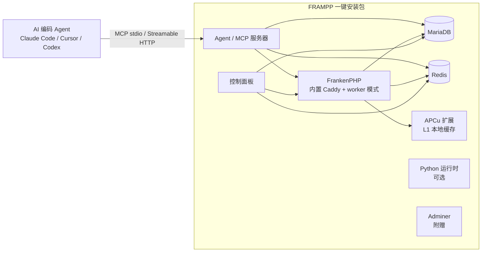

# FRAMPP 项目蓝图

> 状态：设计稿 v1.1（2026-08-19，M1 组件定版）
> 用途：独立 Codex 项目启动时的实施依据
> 前置调研：已完成（组件选型、命名、Agent/MCP 定位、生态现状）

---

## 1. 项目定位

一句话：FRAMPP 是一个面向现代 PHP 开发者的“一键安装、开箱即用”的运行环境与开发平台，延续 LAMPP / XAMPP / NMPP 的命名与产品形态，但底座换成 FrankenPHP，并把 **AI Agent 接入（MCP）作为一级组件**。

- 目标用户：PHP 开发者（本地开发）、小团队（内网部署 / 演示）、开源社区
- 平台：**Windows 优先**（与 XAMPP 一致的形态），Linux / macOS / Docker 变体为后续里程碑
- 差异化定位：不是“又一个 PHP 环境”，而是 **AI 时代的 PHP 运行环境**——自带 Agent（MCP 服务器），把 MySQL / Redis / 日志 / 项目环境开放给主流 AI 编码工具

---

## 2. 命名与谱系

### 2.1 字母含义

| 字母 | 组件 | 角色 |
| --- | --- | --- |
| F | FrankenPHP | 应用服务器（内置 Caddy、自动 HTTPS、worker 模式） |
| R | Redis | 分布式缓存 / 队列 / 会话 |
| A | Agent | MCP 服务器：对接 AI Agent 的工具接入层 |
| M | MySQL / MariaDB | 关系数据库（默认发行 MariaDB，字母含义不变） |
| P | PHP | 主要开发语言 |
| P | Python | 支撑语言：自动化 / AI 负载（可选组件） |

### 2.2 谱系

`LAMPP(Linux+Apache+MySQL+PHP+Perl)` → `XAMPP(X+Apache+MySQL+PHP+Perl)` → `NMPP(Nginx+MySQL+PHP+Perl)` → **`FRAMPP(FrankenPHP+Redis+Agent+MySQL+PHP+Python)`**

### 2.3 决策记录（不重复调研）

- **A 的候选评估**：APCu（进程内缓存）、Adminer（数据库管理）、Authelia（SSO/2FA）、Apache APISIX（API 网关）。
  - 结论：**A = Agent**。理由：差异化最大（同类产品无此形态）、生态时机成熟（MCP 已成事实标准）、与开源贡献目标契合。
  - APCu 不占字母，作为**内置扩展**默认附带（L1 本地缓存，与 Redis 组成两级缓存）。
  - Adminer 作为附赠开发工具（不占字母）。
  - Authelia 否决 / 移除：SSO / 2FA 属具体应用开发范畴，不作为平台组件（v1.1 定版）。
  - Apache APISIX 否决：与 FrankenPHP 内置 Caddy 职责重叠，依赖 etcd/OpenResty，过重。
- **最后一个 P**：Perl → Python。
  - 理由：Perl 在现代 PHP 开发中已无实际场景（XAMPP 中属历史包袱）；Laragon 等现代 Windows PHP 环境已用 Python 取代 Perl；Python 与 Redis / MySQL / AI 生态协同更好。
- **名称可用性**：未检索到同名知名项目，可放心使用。

### 2.4 M1 组件定版（v1.1）

- **M = MariaDB（默认）**：再分发许可更宽松、与 XAMPP 先例一致、Windows 原生支持成熟；MySQL 保留为可选。字母含义不变。
- **R = Redis（Windows 直接用 Redis）**：官方无原生 Windows 构建（官方文档推荐 Memurai / WSL）。采用社区活跃维护的 `redis-windows` 构建（随官方源码同步发布、含安全修复），固定版本 + SHA-256 校验 + 仅绑定 127.0.0.1 + 随机密码。风险中低、可接受并文档化；若维护滞后则切换 Memurai（Redis 官方 Windows 合作伙伴）。
- **P = PHP 由 FrankenPHP 提供（CLI 模式）**：不单独安装 PHP；Web 用 `frankenphp php-server`，命令行用 `frankenphp php-cli`。FrankenPHP v1.12+ 原生支持 Windows（链接官方 Visual Studio 编译的 PHP 二进制，扩展齐全）。
- **Composer 随包集成**：以 `composer.phar` 分发，由 `frankenphp php-cli composer.phar` 执行；M1 需验证 mbstring / openssl / xml 等 Composer 依赖扩展可用。
- **APCu / Adminer 保留**：均为轻量附赠（APCu 扩展 DLL、Adminer 单文件），不占字母，保留在默认发行中。
- **Python 保留为嵌入式轻量方案**：默认勾选的可选组件，用 uv / 嵌入式发行版按需安装，控制包体积。

---

## 3. 总体架构

### 3.1 组件拓扑



### 3.2 缓存分层

- **L1**：APCu（进程内用户缓存；worker 模式下跨 worker 线程共享，需 `apc.enable_cli=1`）
- **L2**：Redis（跨进程 / 跨节点共享、队列、会话）
- 原则：热数据走 L1，共享状态 / 队列一律走 L2
- 注意：水平扩展时 APCu 按进程隔离，多实例共享必须用 Redis

### 3.3 运行模型要点

- FrankenPHP 采用 ZTS 线程模型，worker 模式为默认（Symfony 7.4+ / API Platform 官方支持）
- 官方基准：API Platform 应用在 worker 模式下比 FPM 快约 3.5 倍
- 自动 HTTPS：本地证书 + hosts 管理
- PHP 运行时由 FrankenPHP 自带：Web 与命令行均走 CLI 模式（`php-server` / `php-cli`），不单独安装 PHP；内置 Composer（`php-cli composer.phar`）供项目模板与 Agent 使用

---

## 4. 仓库结构（独立目录 `frampp/`）

```text
frampp/
├─ README.md / LICENSE / CONTRIBUTING.md
├─ docs/                  # 架构、安全、用户手册
├─ src/
│  ├─ php/                # PHP 组件源码（MCP server、控制面板后端）
│  └─ python/             # Python 辅助组件
├─ agent/                 # Agent / MCP 服务器（独立可复用包）
├─ control-panel/         # 控制面板（GUI / CLI）
├─ installer/             # 安装器脚本与打包配置
├─ templates/             # 项目模板：API Platform starter、PHP 最小工程
├─ dist/                  # 第三方二进制（FrankenPHP / MariaDB / Redis / Python）
├─ tests/                 # 单元 / 集成 / 端到端
└─ .github/workflows/     # CI（多平台矩阵）
```

### 4.1 安装后布局（仿 XAMPP）

```text
frampp/
├─ frankenphp/            # 应用服务器 + PHP
├─ mariadb/               # 数据库（MariaDB）
├─ redis/                 # 缓存 / 队列
├─ python/                # Python 运行时（可选）
├─ agent/                 # MCP 服务器
├─ bin/                   # 内置 CLI 工具（composer.phar 等）
├─ htdocs/                # 默认站点目录
├─ logs/                  # 统一日志
├─ data/                  # 数据与配置
└─ FRAMPP Control Panel.exe
```

---

## 5. Agent（MCP 服务器）设计

### 5.1 定位

FRAMPP 的“AI 接入层”：把本地环境能力封装成 MCP 工具，供主流 AI 编码工具调用。

### 5.2 协议

- v1：**MCP（Model Context Protocol）**，stdio + Streamable HTTP 两种 transport
- 路线图：**A2A（Agent2Agent，Linux Foundation / Google 主导）** 作为 2.0
- MCP 已是事实标准：Claude Code、Cursor、Codex、Cline、Copilot、Windsurf 等均支持

### 5.3 工具清单（v0.1）

| 工具 | 说明 | 安全约束 |
| --- | --- | --- |
| `mysql.list_tables` | 列出数据库表 | 只读 |
| `mysql.describe` | 查看表结构 | 只读 |
| `mysql.query` | 执行查询 | 只读账号 + 强制 LIMIT |
| `redis.keys` | 扫描 key（SCAN） | 只读 |
| `redis.get` / `redis.ttl` | 读取值与过期时间 | 只读 |
| `redis.info` | 内存 / 统计信息 | 只读 |
| `logs.tail` | 实时跟踪应用日志 | 路径白名单 |
| `logs.search` | 按关键字过滤日志 | 路径白名单 |
| `env.php_version` / `env.composer_show` | 环境信息 | 只读命令 |
| `env.services_status` | 服务启停状态 | 只读 |
| `env.project_info` | 项目结构 / composer.json | 只读 |

### 5.4 实现选型

- 首选 **PHP**（`php-mcp`，PHP 基金会合作维护），保持“PHP 为主”的定位
- 备选 **Python**（官方 MCP SDK）；若 Agent 采用 Python 实现，则“最后一个 P = Python”的叙事更强——二选一时记录取舍，不混用
- 框架无关：`php-mcp/server` 支持属性注解式声明工具，便于后续扩展
- **M2 决策（2026-08-19）**：v0.1 采用**零外部依赖**的 PHP 实现（自研 MCP stdio 传输层 + RESP 只读客户端 + 工具 `#[AsTool]` 注解）；协议兼容 MCP（initialize / tools/list / tools/call），工具注解风格与 php-mcp 对齐，后续可平滑迁移官方 SDK；理由：本地开发工具包体小、无供应链风险、在受限网络下可完整测试

### 5.5 安全边界（必须项）

- 默认仅绑定 `127.0.0.1`
- MariaDB 独立只读账号（仅 SELECT 权限，自动加 LIMIT）
- Redis 命令白名单（只读命令）
- 外部命令白名单（`php -v`、`composer show` 等只读命令）
- 全部工具调用写审计日志（缓冲到 Redis，落盘）
- 默认关闭或按项目 opt-in 开启

### 5.6 客户端接入示例

```json
{
  "mcpServers": {
    "frampp": {
      "command": "php",
      "args": ["agent/bin/frampp-mcp", "--project", "my-app"]
    }
  }
}
```

---

## 6. 关键实现要点

### 6.1 FrankenPHP

- worker 模式为默认运行方式
- PHP 由 FrankenPHP 自带，默认 CLI 模式：`frankenphp php-server`（Web）、`frankenphp php-cli`（命令行）；Composer 以 `php-cli composer.phar` 方式集成
- 原生 Windows 支持自 v1.12 起（链接官方 Visual Studio 编译的 PHP 二进制，扩展齐全）；M1 锁定版本并校验哈希
- APCu 扩展默认启用；worker 模式需 `apc.enable_cli=1`（官方镜像默认不带，是最易踩的坑）
- `apc.shm_size` 默认预设 128M，控制面板可调
- 自动 HTTPS（本地证书 + hosts 管理）

### 6.2 MariaDB / Redis

- 数据库默认 **MariaDB**（M 字母含义不变）；首次安装生成随机强密码，控制面板可查看 / 重置
- Redis 采用社区 `redis-windows` 构建（随官方源码同步），固定版本 + SHA-256 校验，默认仅绑定 127.0.0.1 + 随机密码；备选 Memurai（Redis 官方 Windows 合作伙伴）
- 端口冲突检测（3306 / 6379 / 443 等）
- Redis 用途：缓存、队列、会话、Agent 审计日志缓冲

### 6.3 Python

- 可选组件，默认勾选
- 用 uv / 嵌入式发行版按需安装，控制包体积
- 用途：AI 负载、数据脚本、Agent 的 Python 实现备选

### 6.4 模板与生态

- **API Platform starter**：与 FrankenPHP 同作者（Kévin Dunglas），官方 demo 即 Symfony + API Platform；v4.x 提供 Symfony / Laravel 适配。示例项目预配 worker 模式 + MariaDB + Redis，装完即可演示完整 API（Swagger + Admin + 自动文档）
- 项目模板创建通过内置 Composer 完成（`frankenphp php-cli composer.phar create-project ...`）
- Adminer：单文件数据库管理，由 FrankenPHP 直接提供

---

## 7. 安全与质量基线

- 默认安全：随机密码、localhost 绑定、最小权限、审计日志
- 测试：单元测试（PHPUnit / Pest）、组件集成测试、安装器全流程测试（Windows VM）、CI（GitHub Actions）
- 发布：GitHub Releases；代码签名列为里程碑（成本项）
- 供应链：第三方二进制哈希校验（含 MariaDB、Redis Windows 构建、composer.phar、扩展 DLL）
- 许可证：项目本体 MIT；**注意第三方二进制再分发条款**（已定：默认 MariaDB，再分发条款宽松，XAMPP 已改用 MariaDB 为先例；MySQL 仅作可选）

---

## 8. 里程碑

| 里程碑 | 内容 | 完成标准 |
| --- | --- | --- |
| M0 仓库落地 | 独立目录 + GitHub 仓库、README、LICENSE、CI 骨架、蓝图入库 | 可 clone、可提交 |
| M1 核心运行时 | FrankenPHP + MariaDB + Redis + APCu 打包；控制面板 MVP（启停 / 状态 / 端口 / 日志） | 安装后一键启动三件套（2026-08-19 已实现并本地验证：download.ps1 / init.ps1 / 控制面板 CLI + Web） |
| M2 Agent v0.1 | MCP 服务器 + MariaDB / Redis / 日志 / 环境工具 + 安全边界 | Claude Code / Cursor 可调用工具 |
| M3 开发体验 | Adminer、本地域名 / HTTPS、API Platform starter、项目一键创建 | 新项目 5 分钟内可跑 API（2026-08-19 已增量实现：Adminer 随包安装 + `frampp new-project`（minimal/symfony/api-platform）；本地域名 / HTTPS 待办） |
| M4 生产模式 | 安装器 / 升级流程、代码签名、多用户文档（Authelia 已移除：属应用开发范畴） | 可对外正式发布 |
| M5 生态 | A2A 路线图、Linux / macOS / Docker 变体、社区贡献指南 | 多平台 CI 通过 |

---

## 9. 风险与开放问题

- **PHP MCP SDK 生态年轻**：命名与“官方”归属有变动，选定后锁定维护活跃的版本
- **已定：默认 MariaDB**（再分发许可宽松），MySQL 仅作可选
- **Windows 原生 Redis**：官方无原生构建，采用社区 `redis-windows` 发行（固定版本 + 哈希校验 + localhost + 随机密码），风险中低；若维护滞后切换 Memurai。Valkey 官方暂无 Windows 支持，仅用于 Linux / macOS 变体
- **FrankenPHP Windows 构建扩展可用性**：M1 需验证官方 Windows 构建含 Composer 所需扩展（mbstring / openssl / xml）及 APCu
- **包体积**：Python 与安装器体积控制，采用可选组件 + 按需下载
- **代码签名**：Windows SmartScreen 信任成本，列为 M4
- **Agent 安全边界**：工具调用权限是社区信任的关键，优先实现并文档化

---

## 10. 下一步

1. ✅ 在独立目录创建 Codex 项目，把本蓝图作为 `docs/blueprint.md` 入库
2. ✅ M0：`git init`、README / LICENSE / CI 骨架、GitHub 仓库（wangbo5825/frampp）
3. ✅ M1：FrankenPHP + MariaDB + Redis + APCu 打包（download.ps1 / init.ps1）+ 控制面板 MVP（启停 / 状态 / 端口 / 日志），本机端到端验证通过
4. 下一步：**M2 Agent v0.1**——MCP 服务器 + MariaDB / Redis / 日志 / 环境工具 + 安全边界
